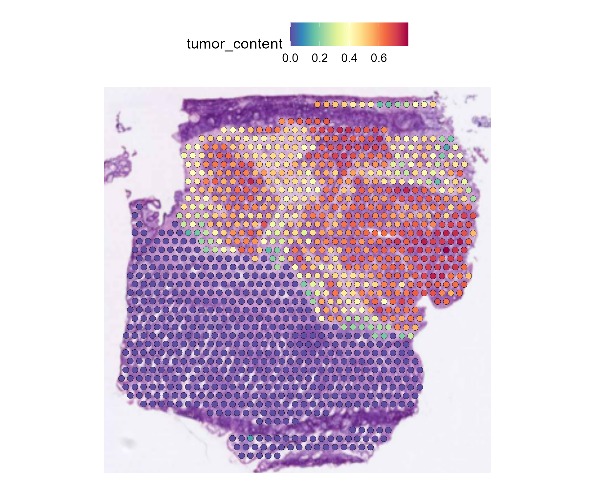
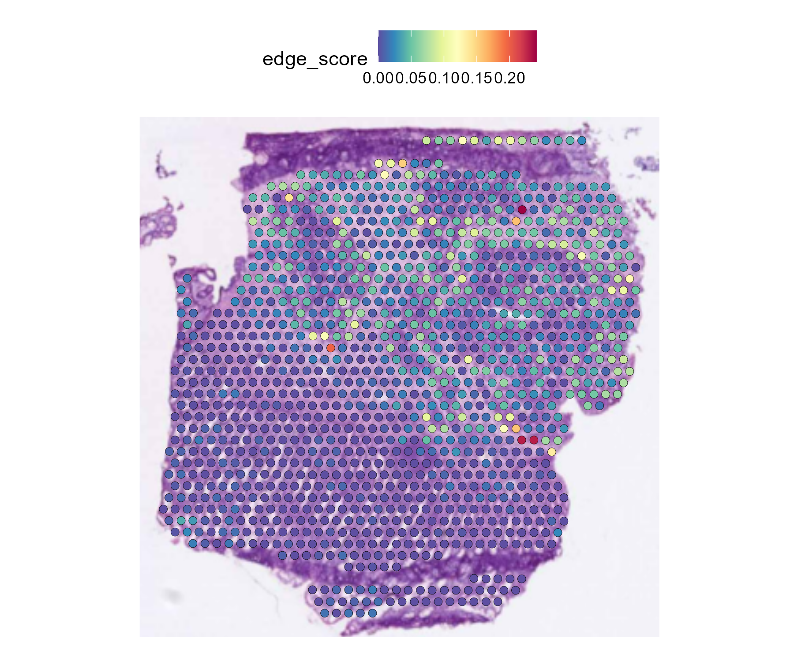
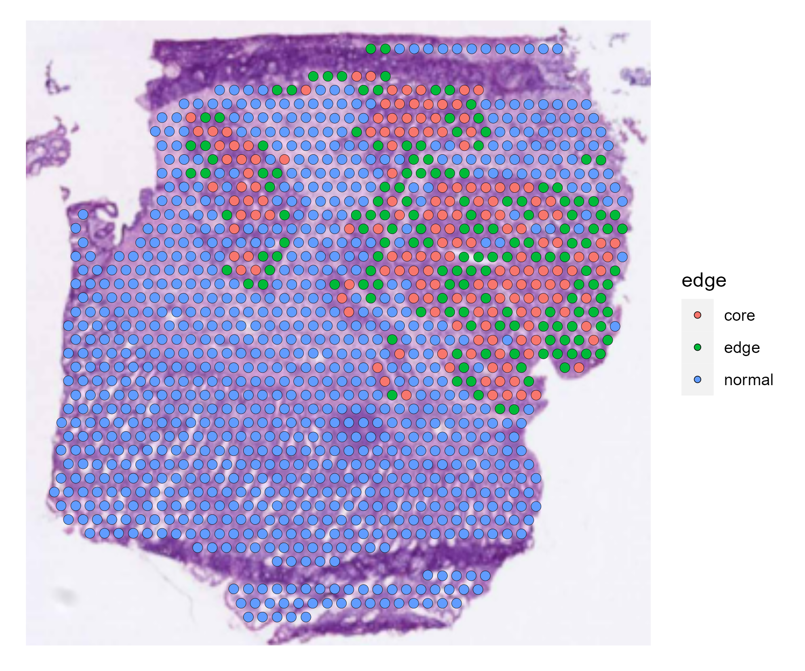

# SpaCNA Demo: Step-by-Step Execution Guide

## System Requirements
- **Operating System:** Windows x64, macOS, or Linux
- **Memory:** Minimum 8 GB RAM
- **Storage:** 2 GB free space
- **Python:** 3.13.11
- **R:** 4.2.1

## 1. Environment Configuration

### 1.1 Python Environment Setup

Open your terminal/command prompt and execute:

```bash
# Create virtual environment
python -m venv spacna_demo_env

# Activate environment
# On Windows:
spacna_demo_env\Scripts\activate
# On macOS/Linux:
source spacna_demo_env/bin/activate

# Install dependencies
pip install torch==2.6.0+cu124 torchvision==0.21.0+cu124 --extra-index-url https://download.pytorch.org/whl/cu124
pip install opencv-python==4.12.0.88 numpy==2.2.6 pandas==2.3.3 scikit-learn==1.8.0 matplotlib==3.10.8 scipy==1.16.3
```


### 1.2 R Environment Setup

Open R or RStudio and run:

```r
# Install from CRAN
install.packages(c("Seurat", "parallelDist", "irlba", "ggplot2", "rootSolve", "patchwork", "glmnet", "dlm"))

# Install BiocManager if needed
if (!require("BiocManager", quietly = TRUE))
    install.packages("BiocManager")

# Install from Bioconductor
BiocManager::install(c("biomaRt", "ComplexHeatmap", "edgeR"))
```


## 2. Prepare Working Directory

Prior to this, you may have a standard 10X raw data structure like:

```txt
# Standard 10X Genomics Spatial Transcriptomics Raw Data Structure
#
# This directory structure is generated by Space Ranger (10X Genomics)
# and contains all necessary files for spatial analysis

demo_data/
└── raw_data/                          # Raw 10X Genomics spatial data
    │
    ├── filtered_feature_bc_matrix.h5    # Filtered gene-barcode matrix (HDF5 format)
    │                                    # Contains only spots under tissue
    │                                    # Rows: genes, Columns: spots/barcodes
    │
    └── spatial/                          # Spatial imaging and coordinate files
        │
        ├── tissue_hires_image.png         # High-resolution histological image
        │                                  # Typically > 2000px resolution
        │
        ├── tissue_lowres_image.png        # Low-resolution image for quick visualization
        │                                  # Typically 600px resolution
        │
        ├── tissue_positions_list.csv      # Spot coordinates under tissue
        │                                  # Columns: 
        │                                  #   barcode, in_tissue, row, col, 
        │                                  #   imagerow, imagecol
        │
        ├── scalefactors_json.json          # Scale factors for image alignment
        │                                  # Contains:
        │                                  #   - spot_diameter_fullres
        │                                  #   - tissue_hires_scalefactor
        │                                  #   - tissue_lowres_scalefactor
        │                                  #   - fiducial_diameter_fullres
        │
        ├── aligned_fiducials.jpg          # Fiducial alignment image
        │                                  # Shows how spots are aligned to tissue
        │
        ├── detected_tissue_image.jpg       # Tissue detection overlay
        │                                   # Shows which spots are under tissue
        │
        └── tissue_positions.csv             # Legacy format (alternative to tissue_positions_list.csv)
                                             # Full spot coordinates including background
```
To obtain prepared data from 10X raw data, you can prepare your data as follows:

```r
# Core packages
library(Seurat)           
library(SeuratObject)     
library(ggplot2)          
library(patchwork)       

# Data retrieval
library(biomaRt)          # Retrieve gene position information from Ensembl

data_dir <- "./demo_data/raw_data/"

#### seurat ####

obj <- Load10X_Spatial(data_dir)
plot1 <- VlnPlot(obj, features = "nCount_Spatial", pt.size = 0.1) + NoLegend()
plot2 <- SpatialFeaturePlot(obj, features = "nCount_Spatial") + theme(legend.position = "right")
wrap_plots(plot1, plot2)

obj <- SCTransform(obj, assay = "Spatial", verbose = FALSE)
# SpatialFeaturePlot(obj, features = c("EPCAM", "KRT19"))

obj <- RunPCA(obj, assay = "SCT", verbose = FALSE)
obj <- FindNeighbors(obj, reduction = "pca", dims = 1:30)
obj <- FindClusters(obj, verbose = FALSE)
obj <- RunUMAP(obj, reduction = "pca", dims = 1:30)

p1 <- DimPlot(obj, reduction = "umap", label = TRUE)
p2 <- SpatialDimPlot(obj, label = TRUE, label.size = 3)
p1 + p2
sample_dir<-'./demo_data/process_data/'
saveRDS(obj, paste0(sample_dir, "seurat_object.rds"))

#### gene position ####
count_RNA <- as.matrix(obj@assays$Spatial@counts)
get_gene_pos <- function(gene_list){
  
  ensembl <- useMart(biomart="ENSEMBL_MART_ENSEMBL", host="grch37.ensembl.org", 
  path="/biomart/martservice", dataset="hsapiens_gene_ensembl")
  
  ensembl <- useDataset("hsapiens_gene_ensembl",mart=ensembl)
  gene_pos <- getBM(attributes=c('hgnc_symbol', 'chromosome_name', 'start_position', 'end_position'),
                    filters=c('hgnc_symbol'),
                    values=list(gene_list),
                    mart=ensembl)
  gene_pos <- gene_pos[gene_pos$chromosome_name %in% c(1:22,"X","Y"),]
  colnames(gene_pos) <- c("symbol","chr","start","end")
  gene_pos$chr <- paste0("chr",gene_pos$chr)
  return(gene_pos)
}

gene_pos <- get_gene_pos(rownames(count_RNA))
saveRDS(gene_pos,paste0(sample_dir, "gene_pos.rds"))

#### spatial location ####
obj<-readRDS(paste0(sample_dir, "seurat_object.rds"))
save_image_info<-function(obj,image_dir,type="10X"){
  if(type=="10X"){
    scalefactors<-obj@images$slice1@scale.factors$hires
    coordinate<-obj@images$slice1@coordinates[4:5]*scalefactors
    spot_name<-rownames(coordinate)
  }else{
    scalefactors<-obj@images$image@scale.factors$hires
    coordinate<-obj@images$image@coordinates[4:5]*scalefactors
    spot_name<-rownames(coordinate)
  }
  write.table (coordinate, file =paste0(image_dir, "exp_location.txt"), sep =" ", row.names =FALSE, col.names =FALSE, quote =TRUE)
  write.table (spot_name, file =paste0(image_dir, "spot.txt"), sep =" ", row.names =FALSE, col.names =FALSE, quote =TRUE)
  knn1<- FindNeighbors(as.matrix(coordinate), 
                       k.param=2, 
                       annoy.metric="manhattan", 
                       return.neighbor=TRUE)
  r<-1/2*Mode(knn1@nn.dist[c(1:nrow(coordinate)),-1])
  
  return(list(coordinate=coordinate,spot_name=spot_name,r=r))
}
image_dir<-'./demo_data/raw_data/spatial/'
spatial_info<-save_image_info(obj,image_dir)
```

Your directory structure should now look like:

```txt
demo_data
├── process_data
│   ├── gene_pos.rds
│   ├── seurat_object.rds  
└── raw_data
    ├── spatial
    │   ├── aligned_fiducials.jpg
    │   ├── detected_tissue_image.jpg
    │   ├── exp_location.txt 
    │   ├── spot.txt
    │   ├── tissue_hires_image.png
    │   ├── tissue_lowres_image.png
    │   ├── tissue_positions_list.csv
    │   └── scalefactors_json.json
    └── filtered_feature_bc_matrix.h5
```


1.  **For Image Feature Extraction (Python):**
    Your sample directory should contain:

      * `tissue_hires_image.png`: The high-resolution histology image.
      * `spot.txt`: A single-column text file containing the cell barcodes for each spot.
      * `exp_location.txt`: A two-column text file (x, y) containing the pixel coordinates of each spot on the `tissue_hires_image.png`.


2.  **For CNA Analysis (R):**
    Your sample directory should contain:

    * `seurat_object.rds`: A standard Seurat object with the following structure:
        * The raw **gene expression matrix** must be stored at `obj@assays$Spatial@counts`.
        * It must contain **cell clustering results** (e.g., in `obj$seurat_clusters`) or custom cell-type annotations that can be used to define which spots will serve as the normal reference.

    * `gene_pos.rds`: A `data.frame` containing the genomic annotation for genes, which must include the following columns:
        * `symbol`: The gene symbol.
        * `chr`: The chromosome name (e.g., "chr1").
        * `start`: The gene's start position in base pairs (bp).
        * `end`: The gene's end position in base pairs (bp).

## 3. Execute the Pipeline
### Step 1: Extract Image Features
```bash
# Make sure environment is activated
python get_spatial_feature.py --sample_dir "./demo_data/raw_data/spatial/" --radius 13
```
Verification: Check outputs were created:

```bash
ls ./demo_data/raw_data/spatial/resnet50/    # Should contain features_pca.txt
ls ./demo_data/raw_data/spatial/plot/        # Should contain contains graph images corresponding to different image thresholds. Based on the plot, select an appropriate image_thre for Step 2.
```

### Step 2: Detect CNAs with SpaCNA
```bash
Rscript SpaCNA.R \
    --sample_dir="./demo_data/process_data" \
    --image_dir="./demo_data/raw_data/spatial" \
    --plot_dir="./demo_data/result" \
    --normal_clusters="1,4,5,6" \
    --dlm_dV=0.1 \
    --dlm_dW=0.0001 \
    --image_thre=0.2
```
**Note:** Adjust --normal_clusters based on your specific data. Check your seurat_object.rds for cluster information. Adjust --image_thre based on plots generated from Step 1.

**Verification:**
```bash
ls ./demo_data/results/     # Should contain CNA results and plots
```

Your results should now look like:

```txt
demo_data/
└── result/                          # Results directory containing CNV analysis outputs
    ├── bk_bic.rds                    # Segment breakpoints from CNV analysis using BIC-seq
    ├── cns_init.png                   # CNV heatmap before HMRF (Hidden Markov Random Field)
    ├── cns.png                         # CNV heatmap after HMRF smoothing
    ├── cns.rds                          # Gene × spot matrix of CNV values after HMRF
    ├── copy_ratio.png                   # Heatmap of copy ratios
    ├── count_norm.rds                    # Gene × spot matrix of copy ratios
    └── hrmf_para.rds                      # Gaussian distribution parameters used for HMRF
```
**Tips:**
If your data is too large, you can consider using the following code to merge spots:
```bash
 Rscript merge_spot.R --input data/seurat_obj.rds --output ./output
```


### Step 3: Estimate Tumor Content (Optional)
```bash
Rscript estimate_tumor_content.R \
    --sample_dir="./demo_data/process_data" \
    --plot_dir="./demo_data/result" \
    --spacna_dir="./demo_data/result" \
    --K=7 \
    --cnv_thre==10
```
**Verification:**
```bash
ls ./demo_data/results/     # Should contain CNA results and plots
```
Your results should contain: 
```txt
demo_data/
└── result/                          
    ├── spacna_tumor_content.png              # Image showing tumor proportion
    └── tumor_content_df.rds                   # Dataframe with spot names as row names and estimated tumor proportion in p_estimate column
```

| Tumor Content |
|------------------------|
|  |

### Step 4: Detect Tumor Edge (Optional)

```bash
Rscript estimate_tumor_edge.R \
--sample_dir="./demo_data/process_data" \
    --plot_dir="./demo_data/result" \
    --spacna_dir="./demo_data/result" \
    --tumor_content_dir="./demo_data/result" \   
    --edge_thre=0.03 \
    --tumor_thre = 0.55
```

**Verification:**
```bash
ls ./demo_data/results/     # Should contain CNA results and plots
```
Your results should contain: 
```txt
demo_data/
└── result/                          
    ├── spacna_edge.png              # Image showing tumor edge score
    └── spacna_edge_score.png         # Image showing tumor edge 
```

| Edge Score Distribution | Tumor Edge Detection |
|------------------------|----------------------|
|  |  |


